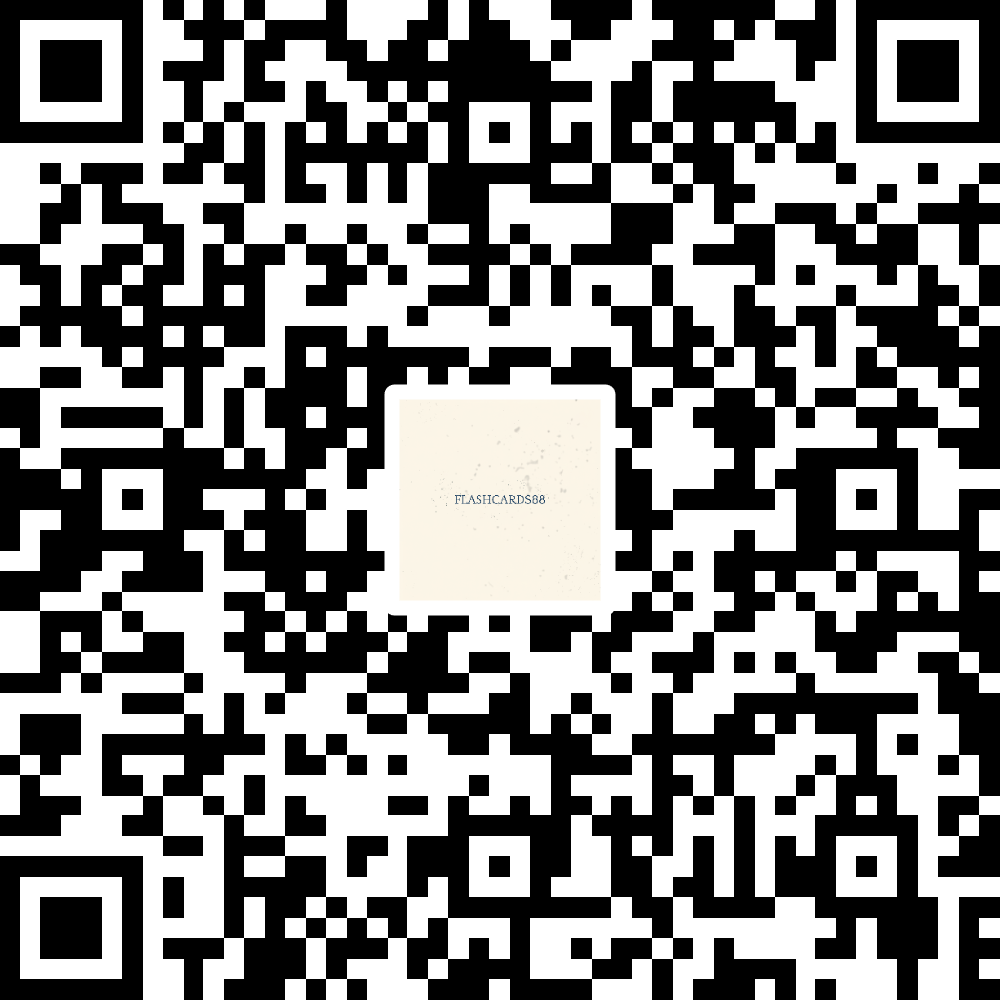

# FLASHCARDS88

**Learn. Recall. Repeat.**

*Apprendre. Se souvenir. Répéter.*

 

 

### [⬇️ Download the latest APK](https://github.com/mohamed005cheikh-rgb/FLASHCARDS88-/releases/latest)

 

---

## What this is

A small, focused flashcard app for Android. You write questions and answers, review them at the moment you are about to forget them, and rate how well you recalled. The app takes care of the rest.

No accounts. No cloud. No tracking. No notifications.

---

## The philosophy

Most study apps are loud. They send push notifications, chase streaks, and turn learning into a performance. We deliberately took a different path.

**No notifications.** The app never interrupts you. When you open it, it shows what is ready to review — nothing more. Constant reminders turn a personal habit into an external obligation, and they break the focus they claim to protect.

**No accounts.** There is nothing to sign up for, nothing to log into.

**No cloud.** Your decks never leave your device unless you export them yourself.

**No tracking.** No analytics, no advertising, no third-party scripts.

**No gamification.** No leagues, no badges, no streak guilt. Learning is not a game — treating it like one usually backfires.

You decide when to study. The app simply makes it easy.

---

## How it works

Two ideas, kept simple.

**Active recall.** You try to remember before seeing the answer. That small effort is what builds memory — not re-reading.

**Spaced repetition.** Each card returns just before you are about to forget it, scheduled by the SM-2 algorithm. The more honestly you rate your recall, the sharper the next interval becomes.

---

## Features

- **SM-2 spaced repetition** — each card adapts to your memory
- **Six themes** — Paper, Aurora, Ember, Night, Mono, Violet
- **Backup and restore** — one JSON file with everything
- **CSV / Anki import** — bring your cards from other apps
- **Swipe to rate** — left for Again, right for Good
- **Haptic feedback** — small taps on flip and rating
- **Offline first** — works without internet, always
- **No permissions beyond storage** — nothing else requested

---

## Screenshots

  
  
  

  <em>The home screen, a review session, and the theme picker.</em>

<!--
  To add your screenshots:
  1. Create a folder named "screenshots" in the repository root
  2. Place your images inside, named: home.png, study.png, themes.png
  3. Commit and push — GitHub will display them automatically
-->

---

## Install

**Option 1 — Direct download**

1. Open [the latest release](https://github.com/mohamed005cheikh-rgb/FLASHCARDS88-/releases/latest)
2. Download `88.apk`
3. Open the file on your Android phone
4. If Android asks, allow installing from unknown sources
5. Tap Install

**Option 2 — Scan the QR code**

  

  <em>Scan with your phone camera to open the download page.</em>

<!--
  To add your QR code:
  1. Go to qrcode-monkey.com
  2. Paste this URL: https://github.com/mohamed005cheikh-rgb/FLASHCARDS88-/releases/latest
  3. Customize the color and add your logo if you like
  4. Download as PNG (700×700)
  5. Save it as screenshots/qr-code.png
-->

**A note about the warning.** Android will warn you that this app comes from an unknown source. That is standard for any APK distributed outside the Play Store. The app is safe, open, and auditable — the full source is in this repository.

---

## Requirements

- Android 8.0 (Oreo) or later
- About 15 MB of free storage
- No internet connection required after install

---

## Your data

Everything is stored locally on your device. Nothing is uploaded anywhere. Ever.

If you clear your browser data or uninstall the app, your decks will be removed too. Use **Backup now** in Settings to save a copy you can restore or move to another device.

You can export your full library at any time as a single JSON file. You can also import decks from CSV files or from an Anki export.

---

## About

**FLASHCARDS88** is an independent project, designed and built by **MC88**.

It is not affiliated with any company, does not have investors, and does not intend to monetize. It exists because a quiet, honest study tool should exist.

If you find a bug, please [open an issue](https://github.com/mohamed005cheikh-rgb/FLASHCARDS88-/issues).

If you build something with it, or simply find it useful, I would like to hear about it.

**Contact:** Mohamed005cheikh@gmail.com

---

**Built for learning, not distraction.**

© MC88 · FLASHCARDS88 v2.1.0

